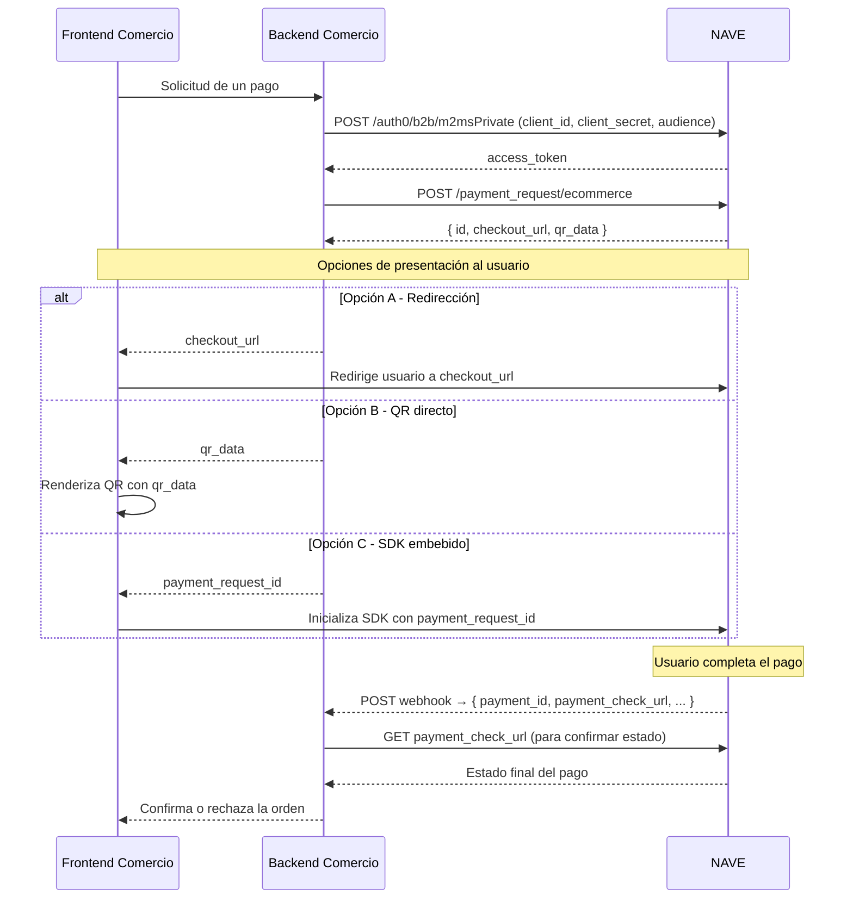
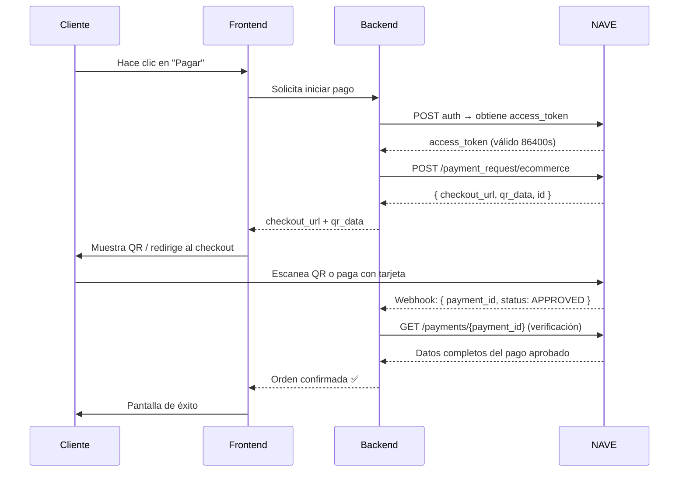
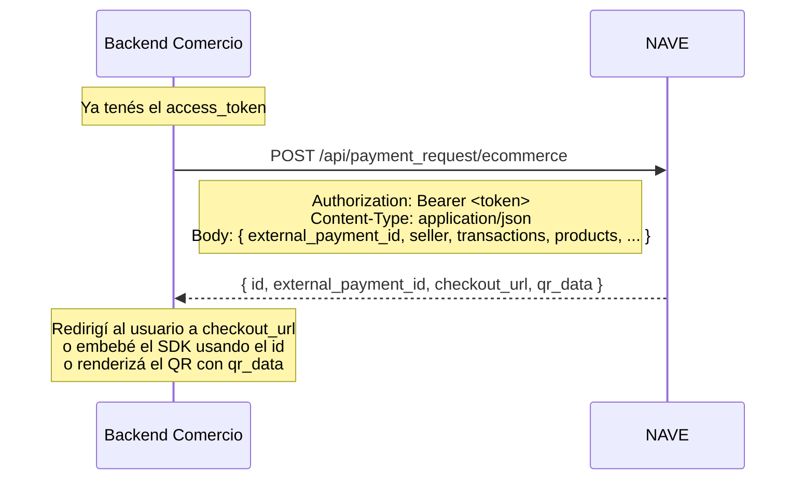
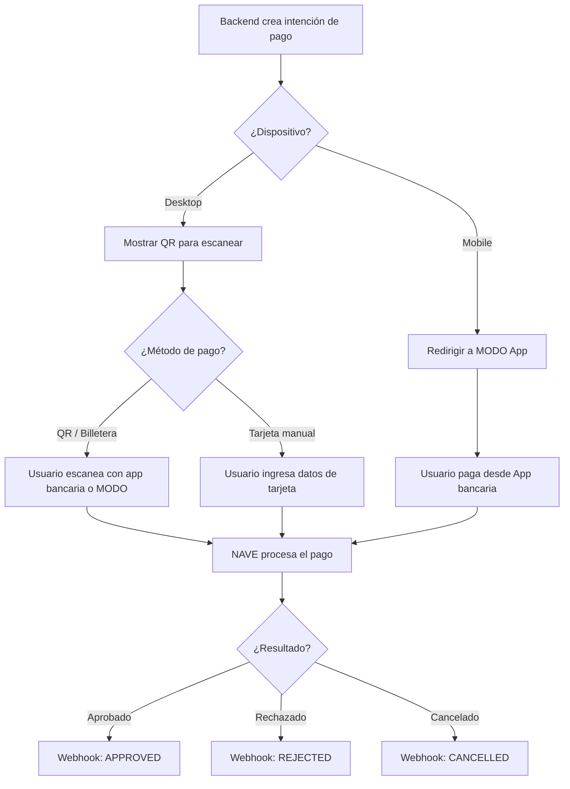
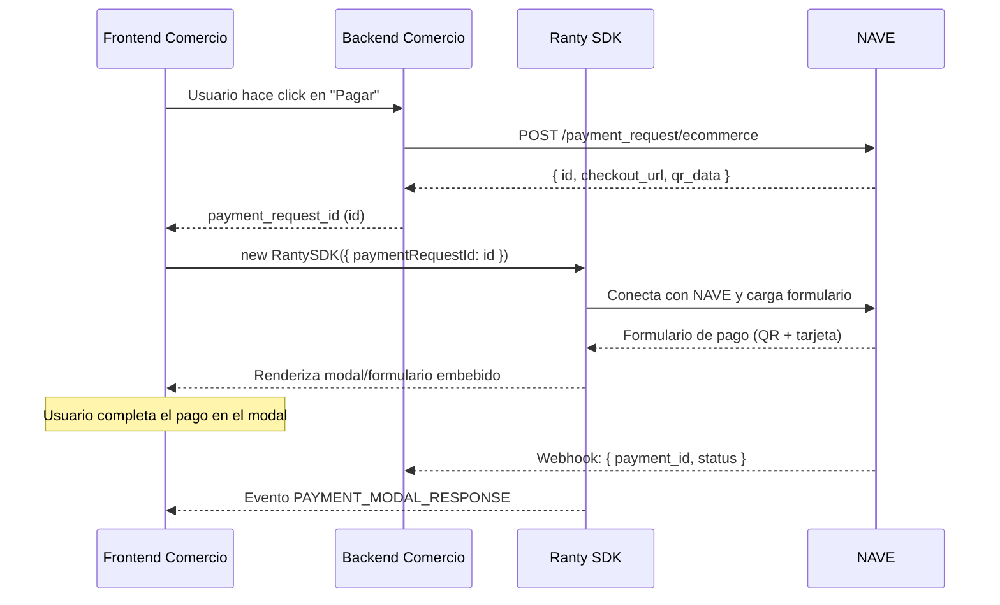
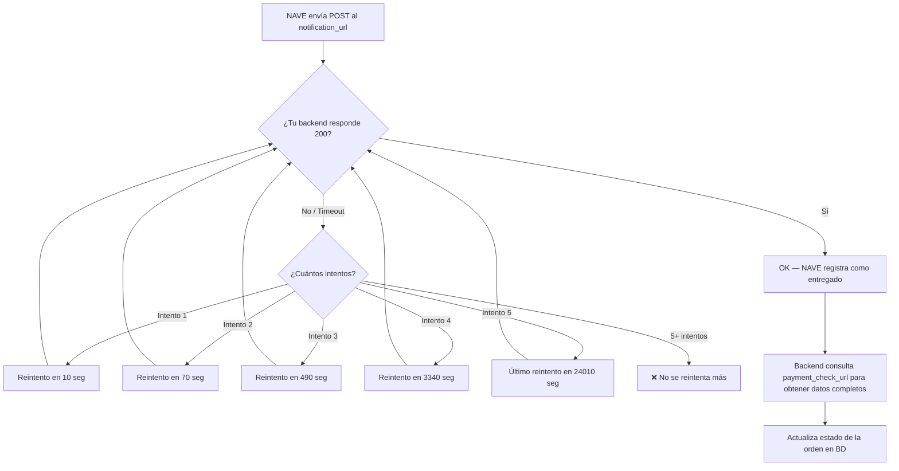
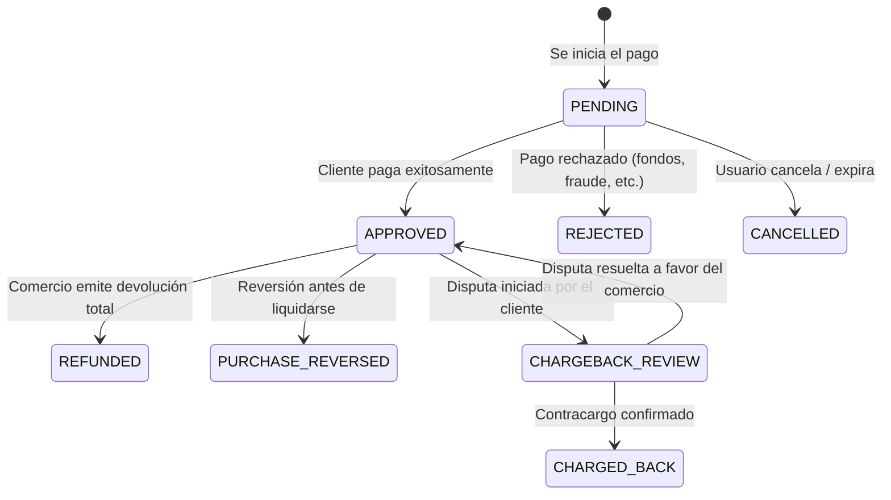
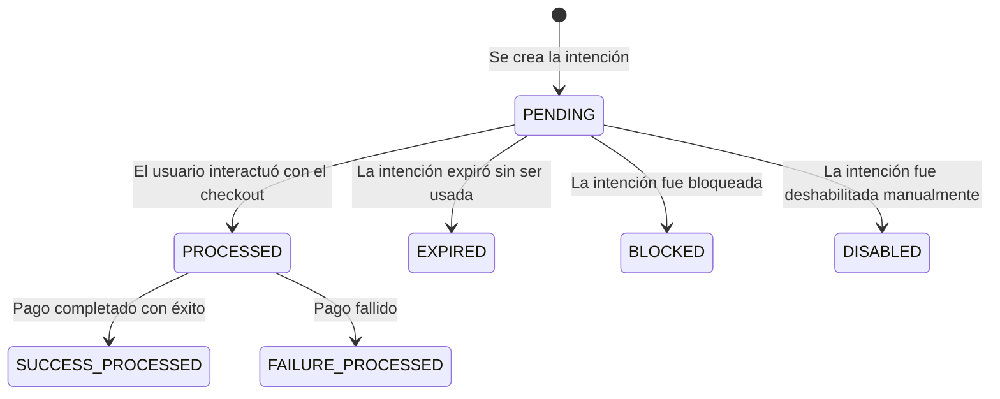
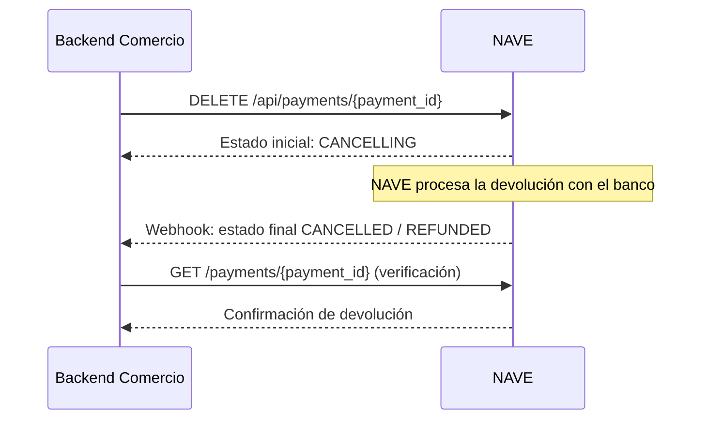
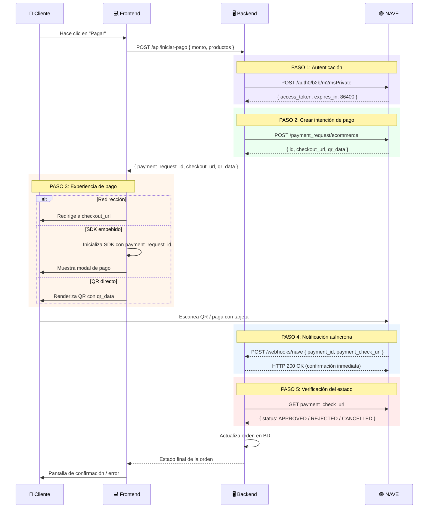

# Documentación Técnica: Checkout con NAVE
## API de Cobros Online — Banco Galicia

> **Fuente**: [navenegocios.ar/home/developers](https://navenegocios.ar/home/developers)  
> **Scrapeado**: 2 de Marzo, 2026  
> **Secciones**: Checkout completo — Cobros online

---

## ÍNDICE

1. [Introducción](#1-introducción)
2. [Ciclo de vida de un pago](#2-ciclo-de-vida-de-un-pago)
3. [Autenticación](#3-autenticación)
4. [Crear intención de pago](#4-crear-intención-de-pago)
5. [Redirección al Checkout](#5-redirección-al-checkout)
6. [Checkout embebido (SDK Client-Side)](#6-checkout-embebido-sdk-client-side)
7. [Notificación de un pago (Webhook)](#7-notificación-de-un-pago-webhook)
8. [Recuperar un pago](#8-recuperar-un-pago)
9. [Estados posibles de un pago](#9-estados-posibles-de-un-pago)
10. [Consultar una intención de pago](#10-consultar-una-intención-de-pago)
11. [Estados de una intención de pago](#11-estados-de-una-intención-de-pago)
12. [Cancelar una intención de pago](#12-cancelar-una-intención-de-pago)
13. [Cancelación de un pago (Refund)](#13-cancelación-de-un-pago-refund)
14. [Renderizar QR en el frontend](#14-renderizar-qr-en-el-frontend)
15. [Eventos del modal de pago (SDK)](#15-eventos-del-modal-de-pago-sdk)
16. [Motivos de rechazo frecuentes](#16-motivos-de-rechazo-frecuentes)
17. [Tarjetas de prueba (Sandbox)](#17-tarjetas-de-prueba-sandbox)

---

## 1. Introducción

**Checkout con Nave** permite integrar cobros vía API en sitios web o aplicaciones móviles, soportando:
- ✅ Pagos con **QR interoperable** (MODO, billeteras virtuales, bancos)
- ✅ Pagos con **tarjetas de crédito y débito**
- ✅ Checkout embebido (modal en tu propio sitio)
- ✅ Redirección a la página de checkout de NAVE

### ¿Qué necesitás para empezar?

1. **Credenciales de sandbox y producción**: te permiten generar un token de acceso para comunicarte con nuestras APIs. Obtenerlas desde **Nave > Integraciones > Tienda Online Propia**.
2. **Utilizar nuestras APIs**: para generar intenciones de pago en tiempo real.
3. **Elegir cómo mostrar el proceso de pago**: podés renderizar un QR, embeber el SDK o redirigir al usuario a nuestro checkout.

### Contacto para credenciales

Para obtener las credenciales, necesitás compartirle a NAVE:
- **CUIT del comercio**
- **Dos URLs de notificación (`notification_url`)**:
  - Una para el entorno de **sandbox**, donde recibirás notificaciones de prueba
  - Otra para **producción**, donde recibirás notificaciones de pagos reales en tiempo real

📌 Enviá la información a través de tu **ejecutivo Galicia** o escribí a: **integraciones@navenegocios.com**

Además, completá el flujo de alta desde la plataforma Nave:
1. Ingresá a **Nave > Integraciones > Tienda Online Propia**
2. Completá el proceso de vinculación
3. Al completar el proceso, recibirás tus credenciales (`client_id` y `client_secret`)

---

## 2. Ciclo de vida de un pago

**Conocé el flujo completo desde la autenticación hasta la acreditación:**

1. Obtener un `access_token` con el servicio de autenticación
2. Generar una intención de pago
3. Redireccionar al usuario al `checkout_url` o renderizar el QR
4. Recibir notificaciones de estado de pago en tiempo real

### Diagrama completo del ciclo de vida



### Diagrama simplificado (Happy Path — Pago Aprobado)



---

## 3. Autenticación

Antes de llamar a cualquier API, se debe obtener un token Bearer con credenciales **machine-to-machine**.

> ⚠️ **Esta información es privada. No la compartas con nadie.**

### Endpoints

| Entorno | Método | URL |
|---------|--------|-----|
| **Sandbox** | `POST` | `https://homoservices.apinaranja.com/security-ms/api/security/auth0/b2b/m2msPrivate` |
| **Producción** | `POST` | `https://services.apinaranja.com/security-ms/api/security/auth0/b2b/m2msPrivate` |

### Headers

```
Content-Type: application/json
```

### Body

```json
{
  "client_id": "eGXu7VV...LsXWylDmrE",
  "client_secret": "BAdrFax_McS...JLBTH-n",
  "audience": "https://naranja.com/ranty/merchants/api"
}
```

### Parámetros del body

| Atributo | Descripción | Tipo | Requerido |
|----------|-------------|------|-----------|
| `client_id` | Identificación del cliente | String | Sí |
| `client_secret` | Clave secreta | String | Sí |
| `audience` | Audiencia provista por NAVE | String | Sí |

> 💡 **Recomendación**: Implementá una política de reintentos contra las APIs de NAVE.

### Respuesta

```json
{
  "access_token": "eyJhbGci0iJS...1A",
  "scope": "read... write...",
  "expires_in": "86400",
  "token_type": "Bearer"
}
```

### Atributos de la respuesta

| Atributo | Descripción | Tipo |
|----------|-------------|------|
| `access_token` | Token generado | String |
| `scope` | Permisos habilitados | String |
| `expires_in` | Tiempo de vida en segundos (24hs) | String |
| `token_type` | Tipo de token (`Bearer`) | String |

---

## 4. Crear intención de pago

La intención de pago es la **solicitud formal para iniciar una transacción**.

### Diagrama del flujo de creación



### Endpoints

| Entorno | Método | URL |
|---------|--------|-----|
| **Sandbox** | `POST` | `https://api-sandbox.ranty.io/api/payment_request/ecommerce` |
| **Producción** | `POST` | `https://api.ranty.io/api/payment_request/ecommerce` |

### Headers

```
Authorization: Bearer <token>
Content-Type: application/json
```

### Body de ejemplo

```json
{
  "external_payment_id": "order-111",
  "seller": {
    "pos_id": "f71ba756-1d80-4ab3-9f43-5dc247fd6c4a"
  },
  "transactions": [
    {
      "amount": {
        "currency": "ARS",
        "value": "177.00"
      },
      "products": [
        {
          "name": "Nave product",
          "description": "Nave description",
          "quantity": 1,
          "unit_price": {
            "currency": "ARS",
            "value": "177.00"
          }
        }
      ]
    }
  ]
}
```

### Atributos del body

| Atributo | Descripción | Tipo | Requerido |
|----------|-------------|------|-----------|
| `external_payment_id` | Identificador del pago en tu plataforma (máx. 36 caracteres) | String | Sí |
| `seller.pos_id` | ID del punto de venta en Nave | String | Sí |
| `transactions` | Datos de la operación | Object | Sí |
| `transactions.amount.currency` | Moneda (siempre `"ARS"`) | String | Sí |
| `transactions.amount.value` | Monto total: indicar siempre con **dos decimales** | String | Sí |
| `products` | Datos del producto | Object | Sí |
| `products.name` | Nombre del producto | String | Sí |
| `products.description` | Descripción del producto | String | No |
| `products.quantity` | Cantidad | String | Sí |
| `products.unit_price.currency` | Moneda del precio unitario | String | Sí |
| `products.unit_price.value` | Precio unitario: indicar siempre con **dos decimales** | String | No |
| `buyer` | Datos del comprador | Object | No |
| `buyer.doc_number` | Número del documento de identificación | String | No |
| `buyer.phone` | Número de teléfono (incluyendo código de país) | String | No |
| `buyer.billing_address` | Datos del domicilio del cliente | String | No |
| `buyer.billing_address.street_1` | Segunda línea opcional de dirección de facturación | String | No |
| `buyer.billing_address.street_2` | Segunda línea opcional de dirección de facturación | String | No |
| `buyer.billing_address.city` | Ciudad de la dirección de facturación | String | No |
| `buyer.billing_address.region` | Región o provincia de la dirección de facturación | String | No |
| `buyer.billing_address.country` | País de la dirección de facturación | String | No |
| `buyer.billing_address.zipcode` | Código postal de la dirección de facturación | String | No |
| `additional_info.callback_url` | URL a la que el cliente es redirigido una vez aprobado el pago (automáticamente a los 5 segundos o al presionar "Volver a la tienda") | String | No |
| `duration_time` | Tiempo de expiración en segundos. **Por defecto: 1 semana** | String | No |

### Respuesta

```json
{
  "id": "ebac56ab-89f2-4419-941e-670f801d9c7b",
  "external_payment_id": "viabarilo_001",
  "checkout_url": "https://sandbox.../nave/sdk?payment_request_id=...",
  "qr_data": "00020101021...670f801d9c8b6304C0AA"
}
```

### Atributos de la respuesta

| Atributo | Descripción |
|----------|-------------|
| `id` | Identificación de la intención de pago en Nave |
| `external_payment_id` | Identificador del pago en tu plataforma (máx. 36 caracteres) |
| `checkout_url` | Link de pago para redireccionar al usuario |
| `qr_data` | Cadena codificada utilizada para renderizar el código QR |

### CURL de ejemplo

```bash
curl --location 'https://api-sandbox.ranty.io/api/payment_request/ecommerce' \
--header 'Content-Type: application/json' \
--header 'Authorization: Bearer <TOKEN>' \
--data '{
  "external_payment_id": "order-111",
  "seller": {
    "pos_id": "f71ba756-1d80-4ab3-9f43-5dc247fd6c4a"
  },
  "transactions": [
    {
      "amount": {
        "currency": "ARS",
        "value": "177.00"
      },
      "products": [
        {
          "name": "Nave product",
          "description": "Nave description",
          "quantity": 1,
          "unit_price": {
            "currency": "ARS",
            "value": "177.00"
          }
        }
      ]
    }
  ]
}'
```

---

## 5. Redirección al Checkout

Podés crear un botón de pago y redireccionar a la URL de NAVE para procesar el pago.

### Experiencia de pago

- **En desktop**: se muestra un **QR para escanear con billetera virtual o banco**. Si el ingreso manual de tarjetas está habilitado, puede completarse el pago ingresando datos manuales.
- **En mobile**: se redirige automáticamente a **MODO** y el usuario puede elegir si pagar desde la APP de MODO o APP bancarias.

### Flujo de redirección



---

## 6. Checkout embebido (SDK Client-Side)

Integrá múltiples formas de pago en tu aplicación o sitio web de manera simple. La librería de NAVE permite **embeber el checkout directamente en tu entorno**, con un estándar low-code que facilita la implementación y genera un formulario de pago totalmente personalizable.

### Ventajas

- **Fácil integración**: embebé la solución sin desarrollos complejos
- **Flexibilidad**: adaptá el flujo de pago a tu aplicación o sitio web
- **Personalización**: generá formularios de pago con tu identidad visual
- **Implementación rápida**: comenzá a cobrar con Nave en minutos

### Instalación

```bash
npm install @ranty/ranty-sdk
```

**Package NPM**: `https://www.npmjs.com/package/@ranty/ranty-sdk`  
**CDN (jsDelivr)**: `https://www.jsdelivr.com/package/npm/@ranty/ranty-sdk`

### Inicialización básica

```javascript
import { RantySDK } from '@ranty/ranty-sdk';

const sdk = new RantySDK({
  paymentRequestId: 'ebac56ab-89f2-4419-941e-670f801d9c7b', // el "id" de la intención de pago
  environment: 'sandbox' // o 'production'
});

sdk.mount('#payment-container'); // el ID del elemento donde se renderiza el modal
```

### Flujo del SDK embebido



---

## 7. Notificación de un pago (Webhook)

NAVE enviará una notificación `POST` asíncrona a tu `notification_url` cuando ocurra un cambio de estado en el pago.

> ⚠️ **Respondé con HTTP 200 OK** para confirmar recepción. Si no se responde con 200, se realizarán hasta **5 reintentos** según la tabla de frecuencias.

### Tabla de reintentos

| Intento | Frecuencia |
|---------|------------|
| 1 | 10 segundos |
| 2 | 70 segundos |
| 3 | 490 segundos (~8 min) |
| 4 | 3340 segundos (~55 min) |
| 5 | 24010 segundos (~6.7 hs) |

### Body del webhook

```json
{
  "payment_id": "ID_DEL_PAGO",
  "payment_check_url": "api.ranty.io/ranty-payments/payments/:id",
  "external_payment_id": "order-111"
}
```

### Atributos del webhook

| Atributo | Descripción | Tipo |
|----------|-------------|------|
| `payment_id` | ID del pago en NAVE | String |
| `payment_check_url` | Endpoint para consultar el estado del pago | String |
| `external_payment_id` | Identificador del pago en tu plataforma (máx. 36 caracteres) | String |

### Flujo de recepción del webhook



### Implementación del webhook (Next.js)

```typescript
// app/api/webhooks/nave/route.ts
import { NextRequest, NextResponse } from 'next/server';

export async function POST(request: NextRequest) {
  try {
    const body = await request.json();
    const { payment_id, payment_check_url, external_payment_id } = body;

    // 1. Verificar que el external_payment_id existe en tu BD
    // 2. Consultar payment_check_url para obtener el estado real
    // 3. Actualizar la orden según el estado
    
    console.log('Webhook recibido:', { payment_id, external_payment_id });

    // CRÍTICO: Siempre responder 200 lo antes posible
    return NextResponse.json({ received: true }, { status: 200 });

  } catch (error) {
    console.error('Error en webhook NAVE:', error);
    // Aun así responder 200 para evitar reintentos si el error es tuyo
    return NextResponse.json({ received: true }, { status: 200 });
  }
}
```

---

## 8. Recuperar un pago

Una vez recibida la notificación del webhook, realizá un `GET` a la `payment_check_url` incluida en el evento. Así obtenés todos los datos actualizados del pago y validás su estado antes de confirmar la orden en tu sistema.

### Endpoints

| Entorno | Método | URL |
|---------|--------|-----|
| **Sandbox** | `GET` | `https://api-sandbox.ranty.io/ranty-payments/payments/{payment_id}` |
| **Producción** | `GET` | `https://api.ranty.io/ranty-payments/payments/{payment_id}` |

### Headers

```
Authorization: Bearer <token>
Content-Type: application/json
```

### Respuesta completa

```json
{
  "id": "ebac56ab-89f2-4419-941e-670f801d9c7b",
  "status": {
    "name": "APPROVED",
    "reason_code": "transaction_successful",
    "reason_name": "Transaction successful"
  },
  "updated_date": "2024-03-07T14:01:09Z",
  "lifecycle_stages": [
    "AUTHORIZATION"
  ],
  "available_balance": {
    "value": "50.00"
  }
}
```

### Ejemplos por estado de pago

**Pago aprobado (APPROVED)**:
```json
{
  "id": "_",
  "status": {
    "name": "APPROVED",
    "reason_code": "transaction_successful",
    "reason_name": "Transaction successful"
  },
  "updated_date": "2024-03-07T14:01:09Z"
}
```

**Pago rechazado (REJECTED)**:
```json
{
  "id": "_",
  "status": {
    "name": "REJECTED",
    "reason_code": "gateway_not_available",
    "reason_name": "Rejected (Gateway not available)"
  },
  "updated_date": "2024-03-07T14:01:09Z"
}
```

**Pago cancelado (CANCELLED)**:
```json
{
  "id": "_",
  "status": {
    "name": "CANCELLED",
    "reason_code": "transaction_successful",
    "reason_name": "Transaction successful"
  },
  "updated_date": "2024-03-07T14:01:09Z"
}
```

---

## 9. Estados posibles de un pago

Estos son los estados que puede tener un **pago** (no la intención de pago):



| Estado | Descripción |
|--------|-------------|
| `APPROVED` | Pago acreditado exitosamente |
| `REJECTED` | Pago rechazado (saldo insuficiente, fraude, vencimiento, etc.) |
| `CANCELLED` | Pago cancelado por el usuario o por expiración |
| `REFUNDED` | El comercio realizó una devolución total del dinero |
| `PURCHASE_REVERSED` | Reversado antes de liquidarse |
| `CHARGEBACK_REVIEW` | Disputa en proceso (iniciada por el cliente) |
| `CHARGED_BACK` | Contracargo confirmado |

---

## 10. Consultar una intención de pago

Podés consultar el estado actual de una **intención de pago** (no confundir con el pago en sí).

### Endpoints

| Entorno | Método | URL |
|---------|--------|-----|
| **Sandbox** | `GET` | `https://api-sandbox.ranty.io/api/payment_requests/{payment_request_id}` |
| **Producción** | `GET` | `https://api.ranty.io/api/payment_requests/{payment_request_id}` |

### Headers

```
Authorization: Bearer <token>
Content-Type: application/json
```

---

## 11. Estados de una intención de pago

Estos son los estados del objeto `payment_request` (la intención), distintos al estado del pago:



| Estado | Descripción |
|--------|-------------|
| `PENDING` | Intención creada, esperando acción del usuario |
| `PROCESSED` | El usuario interactuó con el checkout |
| `SUCCESS_PROCESSED` | La intención derivó en un pago exitoso |
| `FAILURE_PROCESSED` | La intención derivó en un pago fallido |
| `EXPIRED` | La intención expiró sin ser utilizada |
| `BLOCKED` | La intención fue bloqueada |
| `DISABLED` | La intención fue deshabilitada manualmente (vía DELETE) |

---

## 12. Cancelar una intención de pago

Podés cancelar una intención de pago **solo si está activa y no fue utilizada**.

### Endpoints

| Entorno | Método | URL |
|---------|--------|-----|
| **Sandbox** | `DELETE` | `https://api-sandbox.ranty.io/api/payment_requests/{payment_request_id}` |
| **Producción** | `DELETE` | `https://api.ranty.io/api/payment_requests/{payment_request_id}` |

### Headers

```
Authorization: Bearer <token>
Content-Type: application/json
```

> ⚠️ Solo es posible cancelar si la intención tiene estado `PENDING`. Una vez `PROCESSED`, no se puede cancelar.

---

## 13. Cancelación de un pago (Refund)

Podés emitir una devolución de un pago ya aprobado.

### Endpoints

| Entorno | Método | URL |
|---------|--------|-----|
| **Sandbox** | `DELETE` | `https://api-sandbox.ranty.io/api/payments/{payment_id}` |
| **Producción** | `DELETE` | `https://api.ranty.io/api/payments/{payment_id}` |

### Headers

```
Authorization: Bearer <token>
Content-Type: application/json
```

### Flujo de cancelación/devolución



> 📌 El estado inicial tras la solicitud es `CANCELLING`. El estado final (`REFUNDED` o `CANCELLED`) llegará por webhook.

---

## 14. Renderizar QR en el frontend

NAVE ofrece una URL para renderizar el QR directamente desde su infraestructura.

### URL de renderización

```
https://ecommerce.ranty.io/galicia/nave/checkout?payment_request_id={ID}&qr_data={DATOS_QR}
```

### Parámetros

| Parámetro | Descripción |
|-----------|-------------|
| `payment_request_id` | El `id` devuelto al crear la intención de pago |
| `qr_data` | El `qr_data` devuelto al crear la intención de pago |

### Alternativa: renderizar QR con librería propia

Podés usar cualquier librería de generación de QR (como `qrcode.js`, `react-qr-code`, etc.) pasándole el string `qr_data`:

```jsx
// Ejemplo con react-qr-code
import QRCode from 'react-qr-code';

function PaymentQR({ qrData }) {
  return (
    <QRCode
      value={qrData}
      size={256}
      style={{ height: "auto", maxWidth: "100%", width: "100%" }}
    />
  );
}
```

---

## 15. Eventos del modal de pago (SDK)

Cuando usás el **SDK embebido**, el modal emite eventos que podés escuchar para reaccionar al resultado del pago **sin esperar el webhook**.

> 💡 El evento principal es `PAYMENT_MODAL_RESPONSE`.

### Cómo escuchar eventos

```javascript
window.addEventListener('message', (event) => {
  if (event.data.type === 'PAYMENT_MODAL_RESPONSE') {
    const { success, closeModal, rejected, expiration } = event.data.data;

    if (success) {
      // Pago aprobado — redirigir a página de éxito
      console.log('✅ Pago exitoso');
    } else if (rejected) {
      // Pago rechazado
      console.log('❌ Pago rechazado');
    } else if (expiration) {
      // Intención de pago expirada
      console.log('⏰ Pago expirado');
    }
  }
});
```

### Payloads de eventos

**Pago aprobado:**
```json
{
  "type": "PAYMENT_MODAL_RESPONSE",
  "data": {
    "success": true,
    "closeModal": true
  }
}
```

**Pago rechazado:**
```json
{
  "type": "PAYMENT_MODAL_RESPONSE",
  "data": {
    "success": false,
    "rejected": true
  }
}
```

**Pago expirado:**
```json
{
  "type": "PAYMENT_MODAL_RESPONSE",
  "data": {
    "success": false,
    "expiration": true
  }
}
```

### Tabla de eventos del modal

| Payload | Descripción | Acción recomendada |
|---------|-------------|-------------------|
| `success: true, closeModal: true` | Pago aprobado | Redirigir a página de éxito |
| `success: false, rejected: true` | Pago rechazado | Mostrar mensaje de error, ofrecer reintentar |
| `success: false, expiration: true` | Intención expirada | Crear nueva intención de pago |

---

## 16. Motivos de rechazo frecuentes

Estos son los `reason_code` más comunes en pagos rechazados:

| Código (`reason_code`) | Descripción | Acción sugerida |
|------------------------|-------------|-----------------|
| `denied` | Error con el proveedor | Reintentar el pago |
| `no_amount_available` | Fondos insuficientes | Informar al usuario |
| `account_identity_validation_error` | Datos de tarjeta inválidos | Pedir que reingrese los datos |
| `expired_card_invalid_expiry_date` | Fecha de vencimiento de tarjeta inválida | Pedir nueva tarjeta |
| `denied_hold_card` | Rechazado por el banco emisor | Contactar al banco |
| `gateway_not_available` | Gateway no disponible | Reintentar más tarde |

---

## 17. Tarjetas de prueba (Sandbox)

Usá estos números de tarjeta en el entorno de Sandbox. Podés combinar con cualquier fecha de expiración futura y CVV de 3 dígitos, salvo que se especifique lo contrario.

### Tarjetas que devuelven APPROVED

| Marca / Tipo | Número | Expiry | CVV | Resultado |
|-------------|--------|--------|-----|-----------|
| **Visa Crédito (1 cuota)** | `4025 2200 0000 0139` | Cualquiera | Cualquiera | ✅ APPROVED |
| **Visa Crédito (6 cuotas)** | `4761 2299 9900 0231` | `12/31` | `078` | ✅ APPROVED |
| **Visa Débito** | `4507 9900 0000 0019` | Cualquiera | Cualquiera | ✅ APPROVED |
| **Mastercard Crédito** | `5413 3300 0000 0011` | Cualquiera | Cualquiera | ✅ APPROVED |
| **Maestro (Débito)** | `5413 3300 0000 0011` | Cualquiera | Cualquiera | ✅ APPROVED |
| **American Express** | `3712 3300 0000 0015` | Cualquiera | Cualquiera | ✅ APPROVED |
| **Cabal** | `5896 5700 0000 0018` | Cualquiera | Cualquiera | ✅ APPROVED |
| **Naranja Crédito** | `5895 6248 4026 3355` | `04/40` | `928` | ✅ APPROVED |

### Tarjetas que devuelven REJECTED

| Marca / Tipo | Número | Expiry | CVV | Resultado |
|-------------|--------|--------|-----|-----------|
| **Visa Crédito (Error)** | `4025 2200 0000 0127` | Cualquiera | Cualquiera | ❌ REJECTED |

---

## RESUMEN DE ENDPOINTS

### Autenticación

| Entorno | Método | Endpoint |
|---------|--------|----------|
| Sandbox | POST | `https://homoservices.apinaranja.com/security-ms/api/security/auth0/b2b/m2msPrivate` |
| Producción | POST | `https://services.apinaranja.com/security-ms/api/security/auth0/b2b/m2msPrivate` |

### Intenciones de pago

| Entorno | Método | Endpoint |
|---------|--------|----------|
| Sandbox | POST | `https://api-sandbox.ranty.io/api/payment_request/ecommerce` |
| Producción | POST | `https://api.ranty.io/api/payment_request/ecommerce` |
| Sandbox | GET | `https://api-sandbox.ranty.io/api/payment_requests/{payment_request_id}` |
| Producción | GET | `https://api.ranty.io/api/payment_requests/{payment_request_id}` |
| Sandbox | DELETE | `https://api-sandbox.ranty.io/api/payment_requests/{payment_request_id}` |
| Producción | DELETE | `https://api.ranty.io/api/payment_requests/{payment_request_id}` |

### Pagos

| Entorno | Método | Endpoint |
|---------|--------|----------|
| Sandbox | GET | `https://api-sandbox.ranty.io/ranty-payments/payments/{payment_id}` |
| Producción | GET | `https://api.ranty.io/ranty-payments/payments/{payment_id}` |
| Sandbox | DELETE | `https://api-sandbox.ranty.io/api/payments/{payment_id}` |
| Producción | DELETE | `https://api.ranty.io/api/payments/{payment_id}` |

### Checkout embebido

| Recurso | URL |
|---------|-----|
| QR renderizado por NAVE | `https://ecommerce.ranty.io/galicia/nave/checkout?payment_request_id={ID}&qr_data={QR}` |
| npm SDK | `https://www.npmjs.com/package/@ranty/ranty-sdk` |
| CDN | `https://www.jsdelivr.com/package/npm/@ranty/ranty-sdk` |

---

## FLUJO COMPLETO — DIAGRAMA MAESTRO



---

*Documentación extraída de [navenegocios.ar/home/developers](https://navenegocios.ar/home/developers)*  
*Generado el: 2 de Marzo, 2026*
